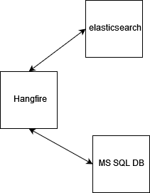
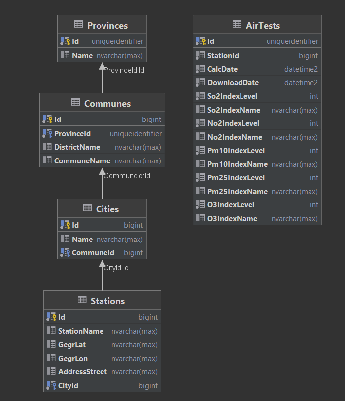
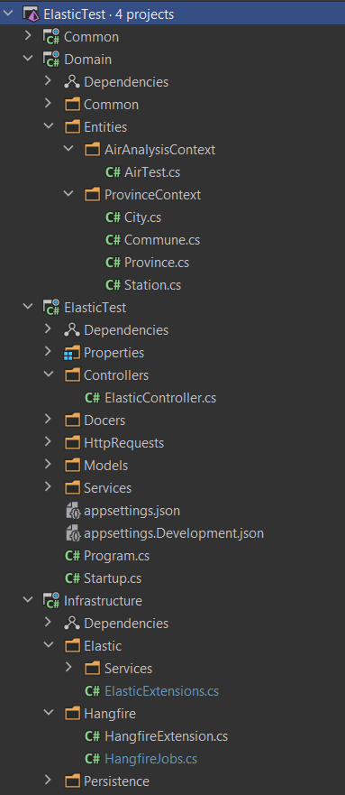
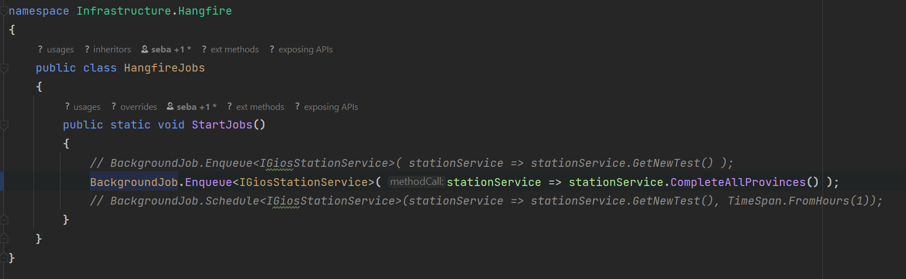
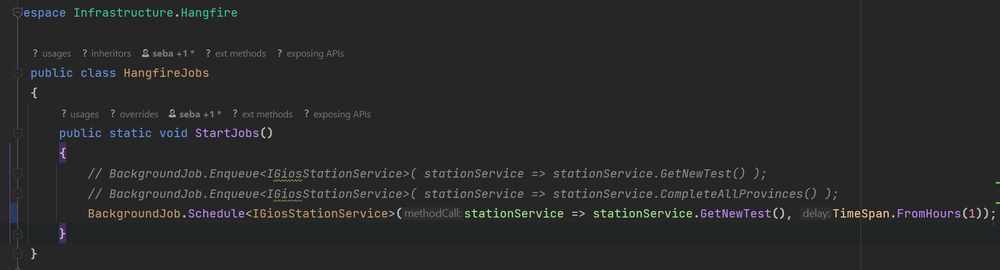
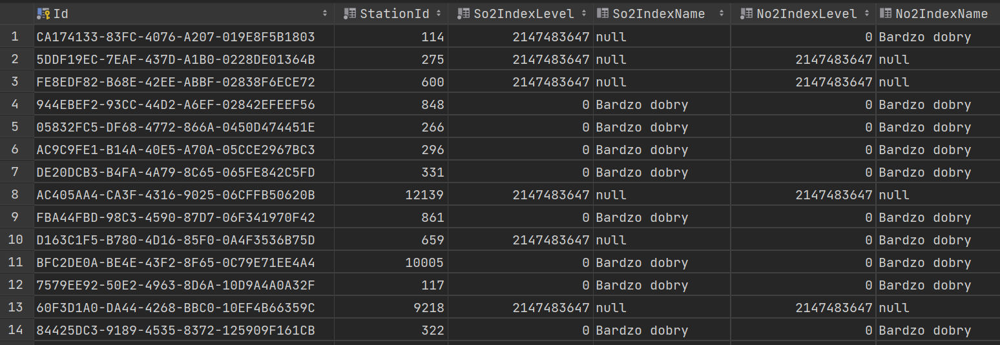

A test application that queries API of **GIOŚ Air Quality portal**.
Collects all air monitoring stations from Poland, and saves them to a database.
Then it cyclically queries all stations for air quality, and saves this data in DB.
In **elasticsearch** the latest readings from the control stations are updated.
With endpoint, you can search for measurements from individual cities/towns

<br />

## Architecture



The architecture is not complicated. 
The hangfire api uses **MS SQL**, both to run the queue system itself. As well as, to save all available measurement stations and the measurement history.

**Elasticsearch** is used to search for *actual / recent* air measurements, from all stations.


## Docker

```docker
version: '3.7'

services:
  database:
    image: mcr.microsoft.com/mssql/server:2019-latest
    container_name: ms-sql
    ports:
      - "1433:1433"
    environment:
      - ACCEPT_EULA=Y
      # user: sa
      - SA_PASSWORD=@Qwert123456789
      - MSSQL_PID=Developer
```

```docker
version: '3.7'

services:
  elasticsearch:
    image: docker.elastic.co/elasticsearch/elasticsearch:7.13.4
    container_name: elastic
    ports:
      - "9200:9200"
    environment:
      - "discovery.type=single-node"
      - "xpack.security.enabled=false"
#    volumes:
#      - esdata:/usr/share/elasticsearch/data 

#volumes:
#  esdata:
#    driver: local
```

Elastic can consume memory, working with 16MB on local hardware can be difficult

## DB Structure



Application domain divided into two contexts
- Province
- Air Test

In the context of **Province** I have arranged the stations,as they are located around the country. </br>
The **AirTest** context stores the test history of each station.

<br />

## ElasticTest (Hangfire) 



The application is tasked with three actions

> **1** 

The first task is to download all air control stations and put them into the database. This task is performed only once at system startup.



The **GIOS APIs** used are:

```http request
GET https://api.gios.gov.pl/pjp-api/rest/station/findAll
```

```json
[
    ...
{
    "id": 16613,
    "stationName": "Nowa Sól",
    "gegrLat": "51.809103",
    "gegrLon": "15.708042",
    "city": {
      "id": 605,
      "name": "Nowa Sól",
      "commune": {
        "communeName": "Nowa Sól",
        "districtName": "nowosolski",
        "provinceName": "LUBUSKIE"
      }
    },
    "addressStreet": "T. Kościuszki"
  },

  ...
]
```

> **2** 

The next step is to update the air states, here I query each station by its **Id**, and then store it in the 
**database**, and the next step is to update the entry in **elastic**. This is done periodically, every hour.



APIs **GIOS**:

```http request
GET https://api.gios.gov.pl/pjp-api/rest/aqindex/getIndex/{id}
```

```json
{
  "id": 52,
  "stCalcDate": "2021-12-19 23:20:17",
  "stIndexLevel": {
    "id": 0,
    "indexLevelName": "Bardzo dobry"
  },
  "stSourceDataDate": "2021-12-19 23:00:00",
  "so2CalcDate": "2021-12-19 23:20:17",
  "so2IndexLevel": {
    "id": 0,
    "indexLevelName": "Bardzo dobry"
  },
  ...
}
```

In elastic, this is stored in the structure
- **index**: tests
- **document**: _doc with **id** of measurement station

```c#
public class AirTestElasticModel
{
    public long Id { get; init; }
    public string CityName { get; init; }
    public DateTime CalcDate { get; init; }
    public DateTime DownloadDate { get; init; }
    public int So2IndexLevel { get; init; }
    public string So2IndexName { get; init; }
    public int No2IndexLevel { get; init; }
    public string No2IndexName { get; init; }
    public int Pm10IndexLevel { get; init; }
    public string Pm10IndexName { get; init; }
    public int Pm25IndexLevel { get; init; }
    public string Pm25IndexName { get; init; }
    public int O3IndexLevel { get; init; }
    public string O3IndexName { get; init; }
}
```
In the database, the record looks like this:



> **3** 

The third is the provision of **Web Api** which will give the ability to download the current air condition from a selected city.


```c#
// GET https://localhost:5001/Elastic?query={city name}
[HttpGet]
public async Task<IEnumerable<AirTestElasticModel>> Get(string query)
{
    var result = await _testElasticService.SearchTests(query);
    return result;
}
```

```json
[
  {
    "id": 11195,
    "cityName": "Kielce",
    "calcDate": "2021-12-19T00:00:00",
    "downloadDate": "2021-12-19T22:20:26.371162Z",
    "so2IndexLevel": 0,
    "so2IndexName": "Bardzo dobry",
    "no2IndexLevel": 0,
    "no2IndexName": "Bardzo dobry",
    "pm10IndexLevel": 0,
    "pm10IndexName": "Bardzo dobry",
    "pm25IndexLevel": 0,
    "pm25IndexName": "Bardzo dobry",
    "o3IndexLevel": 0,
    "o3IndexName": "Bardzo dobry"
  },
  {
    "id": 16196,
    "cityName": "Kielce",
    "calcDate": "2021-12-19T00:00:00",
    "downloadDate": "2021-12-19T22:20:26.3922697Z",
    "so2IndexLevel": 2147483647,
    "so2IndexName": "null",
    "no2IndexLevel": 0,
    "no2IndexName": "Bardzo dobry",
    "pm10IndexLevel": 0,
    "pm10IndexName": "Bardzo dobry",
    "pm25IndexLevel": 2147483647,
    "pm25IndexName": "null",
    "o3IndexLevel": 2147483647,
    "o3IndexName": "null"
  },
  {
    "id": 16497,
    "cityName": "Kielce",
    "calcDate": "2021-12-19T00:00:00",
    "downloadDate": "2021-12-19T22:20:26.4124799Z",
    "so2IndexLevel": 2147483647,
    "so2IndexName": "null",
    "no2IndexLevel": 2147483647,
    "no2IndexName": "null",
    "pm10IndexLevel": 0,
    "pm10IndexName": "Bardzo dobry",
    "pm25IndexLevel": 2147483647,
    "pm25IndexName": "null",
    "o3IndexLevel": 2147483647,
    "o3IndexName": "null"
  }
]
```